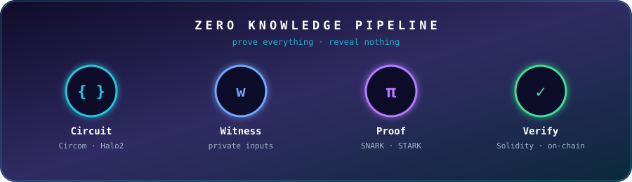

<!-- HEADER WAVE -->


<div align="center">

<!-- TYPING ANIMATION -->
<a href="https://git.io/typing-svg">
  
</a>

<br/>


</div>


## 🧬 Live Profile

<div align="center">
  
</div>


## 💫 About Me


```solidity
contract Alchemist {
    string public name     = "Aditya Kumar Mishra";
    string public mission  = "Let's make Web3 prominent";
    string public learning = "Zero Knowledge & Advanced Cryptography";

    function currentlyBuilding() public pure returns (string memory) {
        return "Trustless things that actually matter 🔭";
    }
}
```

🔭 Actively learning **Zero Knowledge** and **Advanced Cryptography**
⚡ Turning cryptographic math into real-world dApps
🌱 Always shipping, always experimenting

<br clear="right"/>


## 🌐 Let's Connect

<div align="center">

<a href="https://x.com/Adityaalchemist"></a>
<a href="https://linkedin.com/in/aditya-kumar-mishra-alchemy"></a>
<a href="https://instagram.com/aditya_41205"></a>

</div>


## 💻 Tech Arsenal

<div align="center">


<br/><br/>


</div>


## 📊 GitHub Stats

<div align="center">


<br/>


</div>


## 🐍 Snake Eating My Contributions

<div align="center">
  <picture>
    <source media="(prefers-color-scheme: dark)" srcset="https://raw.githubusercontent.com/Aditya-alchemist/Aditya-alchemist/output/github-snake-dark.svg" />
    <source media="(prefers-color-scheme: light)" srcset="https://raw.githubusercontent.com/Aditya-alchemist/Aditya-alchemist/output/github-snake.svg" />
    
  </picture>
</div>


## 🔐 Currently Exploring

<div align="center">
  
</div>

<br/>

## 🧪 The Alchemist's Lab

<div align="center">

| 🔬 Researching | 🛠️ Building With | 🎯 Goal |
| :---: | :---: | :---: |
| ZK-SNARKs & STARKs | Solidity · Rust · Circom | Private, verifiable dApps |
| Elliptic Curves & Pairings | Next.js · Web3.js · Tailwind | Smooth Web3 UX |
| Polynomial Commitments | Hardhat · Foundry | Battle-tested contracts |

<br/>


</div>


<div align="center">

### 🤝 Got a Web3 or ZK idea? Let's build it.

<a href="https://x.com/Adityaalchemist">
  
</a>

</div>

<!-- FOOTER WAVE -->

